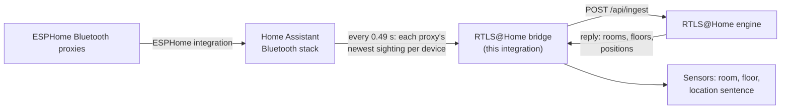

# RTLS@Home

**Room-level Bluetooth positioning for Home Assistant, from inexpensive ESP32 proxies and tags.**

RTLS@Home works out which room a Bluetooth device is in, and roughly where in that room, then gives the answer to
Home Assistant as ordinary sensors. The devices can be tags on keys or a collar, or a phone running an iBeacon.
Ask your assistant "Where is the dog?" and get "Near the ottoman in the living room".

It uses the Bluetooth proxies you may already run for Home Assistant (ESPHome on ESP32 boards). A physics model of
your house turns their signal readings into positions: walls, floors, furniture, and each receiver's measured
quirks.

> **Status: alpha.** This repository holds the Home Assistant integration (the *bridge*). The positioning *engine*
> it talks to is not public yet. It will be once its configuration (floor plans, receivers, calibration) is
> separated from the author's own house. See [the roadmap](docs/architecture.md#roadmap).

## How it works

1. Home Assistant's Bluetooth stack already collects what every proxy hears. The bridge reads it twice a second,
   the same way [Bermuda](https://github.com/agittins/bermuda) does. The proxies stay under the ESPHome
   integration; the bridge never connects to them itself.
2. The bridge sends the engine only the devices the engine asks for, plus each proxy's health and a list of nearby
   devices (so you can pick new tags to track).
3. The engine estimates where each tracked device is and replies. The bridge turns that reply into sensors.

More detail: [architecture](docs/architecture.md), [the ingest protocol](docs/protocol.md).

## Requirements

- Home Assistant 2026.9 or newer, with the Bluetooth integration running.
- ESPHome Bluetooth proxies (ESP32 boards). Identical boards and antennas give the best results.
- A running RTLS@Home engine and the ingest token it was started with.

## Install

Via HACS as a custom repository, or by hand. See [install](docs/install.md), then add the integration under
**Settings → Devices & services → Add integration → RTLS@Home**. The options are described in
[configuration](docs/configuration.md).

## Entities

Each device the engine tracks becomes a Home Assistant device with three sensors:

| Entity | State | Attributes |
|---|---|---|
| `sensor.<device>_room` | the room, e.g. `Living Room` | `floor`, `confidence` (0–1), `x`, `y`, `z` (metres), `radius_m` (68 % radius), `verdict` (`CALL` or `LOW-CONF`), `near` (closest named furniture), `ha_area` (the matching Home Assistant area, if any) |
| `sensor.<device>_floor` | the floor, e.g. `Main` | |
| `sensor.<device>_location` | a sentence, e.g. `Near the ottoman in the Living Room` | |

Sensors write their state when the room or floor changes, and otherwise at most every 10 seconds, so your
database doesn't fill with tiny position changes. If the engine stops tracking a device, its sensors become
unavailable. Delete the device from its page if you no longer want it.

### Ask your assistant

Expose the location sensors to Assist (**Settings → Voice assistants → Expose**). An LLM conversation agent can
then answer "Where is …?" from the sentence.

Coming later: rooms linked to Home Assistant areas, named places that are not areas ("the bonus room closet"), and
an Assist tool that can read the map itself.

## Privacy

Nothing leaves your network. The bridge sends sightings only for devices the engine asks for, plus a list of
nearby devices, and only to the engine you configured. Details: [privacy](docs/privacy.md).

## Why RTLS@Home isn't free to sell

RTLS@Home is free for anyone to use at home, study, change and share. It is not free to sell.

I think we've built something new for home automation: about $150 of off-the-shelf parts (a
handful of ESP32 Bluetooth proxies and a few tags) plus a physics model of your own house, tuned against real
measurements. It tells you which room people and things are in, and where in the room. Commercial
indoor-positioning systems that do this cost many times more.

Something this cheap and this effective is exactly what someone will want to package and sell, for homes or for
businesses. If that happens, I want the people who built it to share in it. So:

- **Personal, hobby, educational, research and non-profit use is free** under PolyForm Noncommercial 1.0.0.
  Tinker with it, fork it, improve it, publish your changes and put your name on them. Just keep the credits.
- **Commercial use needs a commercial licence.** That covers selling it, bundling it into a product, or running it
  for a business. Ask; I'm open to it.
- **Significant contributors:** if commercial licences ever bring in money, I intend to share it with the people
  whose work made that possible. That's a promise of good faith, not a contract; terms would be agreed case by case.

## Accuracy

Measured accuracy will be published in `docs/accuracy.md`, with the method behind it, once validation rounds on
the new reference hardware are done. No number until it can be checked.

## Contributing

See [CONTRIBUTING.md](CONTRIBUTING.md). Development setup and tests: [development](docs/development.md).
Problems: [troubleshooting](docs/troubleshooting.md).

## Credits

- [Bermuda](https://github.com/agittins/bermuda): the inspiration, and the approach of reading each proxy's
  sightings from Home Assistant's Bluetooth stack.
- [Home Assistant](https://www.home-assistant.io/) and [ESPHome](https://esphome.io/), whose Bluetooth proxies
  make inexpensive receivers possible.

## Licence

- Code: [PolyForm Noncommercial 1.0.0](LICENSE.md).
- Documentation and images: [CC BY-NC-SA 4.0](LICENSE-docs.md).
- Commercial licences on request.

`Required Notice: Copyright (c) 2026 Nick Wagner and the RTLS@Home contributors`
