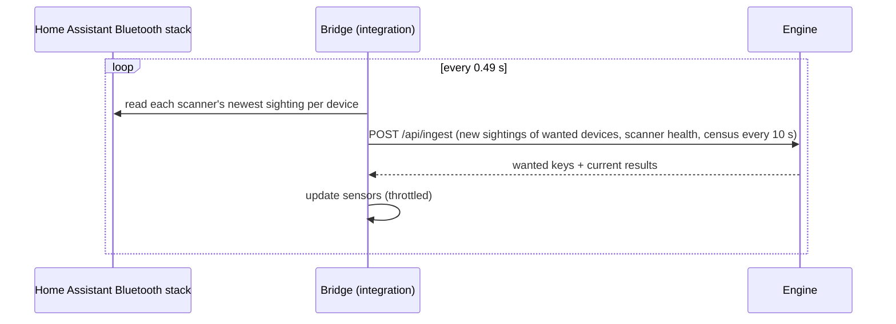

# Architecture

RTLS@Home has two parts:

- **The bridge** (this repository): a Home Assistant integration. It reads what Home Assistant's Bluetooth stack
  has heard, sends it to the engine, and turns the engine's answers into sensors.
- **The engine**: a separate service that holds the house model (floors, walls, furniture, receiver positions and
  their calibration) and estimates where each tracked device is. Not public yet (see [Roadmap](#roadmap)).

## Why read Home Assistant's Bluetooth stack

ESPHome Bluetooth proxies stream advertisements to one API client: Home Assistant. Connecting to them directly would
compete with Home Assistant's own Bluetooth features. Home Assistant already merges every proxy's sightings, so the
bridge reads them there, through the public `bluetooth.async_current_scanners()` API, exactly as
[Bermuda](https://github.com/agittins/bermuda) does. The ESPHome integration stays in charge of the proxies.

## Reading sightings without missing or repeating any

For every scanner, Home Assistant keeps the newest advertisement from each device and the moment it arrived
(`discovered_devices_and_advertisement_data` and `discovered_device_timestamps`, in Home Assistant's monotonic
clock). A proxy refreshes a sighting about once a second, so the bridge polls every **0.49 s**, a little faster than
twice that rate. It remembers the last timestamp it sent for each (scanner, address) pair, so every refresh goes out
exactly once. Entries older than five minutes are forgotten, because phones rotate their Bluetooth addresses and the
table must not grow forever.

## Device keys

A sighting is sent under every key its device is known by:

- the lower-case Bluetooth address, e.g. `00:00:5e:00:53:0a`;
- for an Apple iBeacon (manufacturer 0x004C, type 0x02, length 0x15), `<uuid>_<major>_<minor>`, e.g.
  `00112233445566778899aabbccddeeff_100_40004`. The iBeacon key survives address rotation.

These match Bermuda's keys, so existing device lists carry over.

## What the engine gets, and when

- **Sightings:** only for keys the engine listed as `wanted` in its last reply. Until the first reply, none are sent.
- **Scanner health:** every batch, the seconds since each proxy's last advertisement. The engine marks a proxy dead
  when it goes quiet.
- **Census:** every 10 s, every device heard in the last 60 s (at most 500, loudest first), so a user can pick new tags
  to track.

Full format: [protocol.md](protocol.md).

## Failure handling

- If the engine is unreachable, the bridge backs off (0.5 s, doubling to 30 s) and logs at most once a minute.
  Sightings from that period are dropped: a backlog of stale data is worse than a gap.
- Sensors become unavailable after 30 s without a reply, and recover on the next good one.
- If the engine stops tracking a device, that device's sensors go unavailable; the user can delete the device.

## Roadmap

1. **Bluetooth feed** (this release): the bridge.
2. **Results into Home Assistant** (this release): room, floor and location sensors.
3. **Configuration as data:** floors, rooms, walls, furniture, proxies and devices become an editable model instead
   of code, which also lets the engine be published.
4. **Packaging:** the engine and its web UI as a Home Assistant App and a Docker image.
5. **Editors and onboarding:** draw floors and rooms, place proxies (a proxy counts only once placed), recruit tags
   from the nearby-device list and name them, link rooms to Home Assistant areas, draw named places that are not
   areas, name furniture landmarks, and an Assist tool that can answer "where is …" from the map.
6. **Automatic fitting:** calibration and refits run without a human in the loop.
